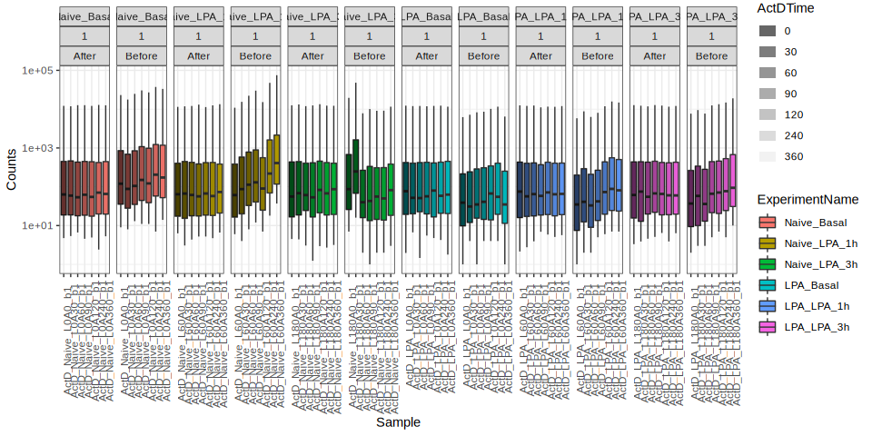
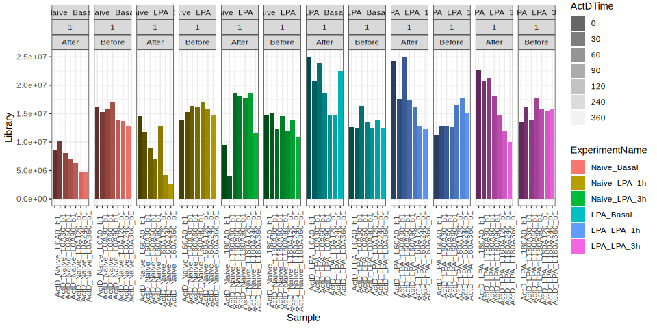
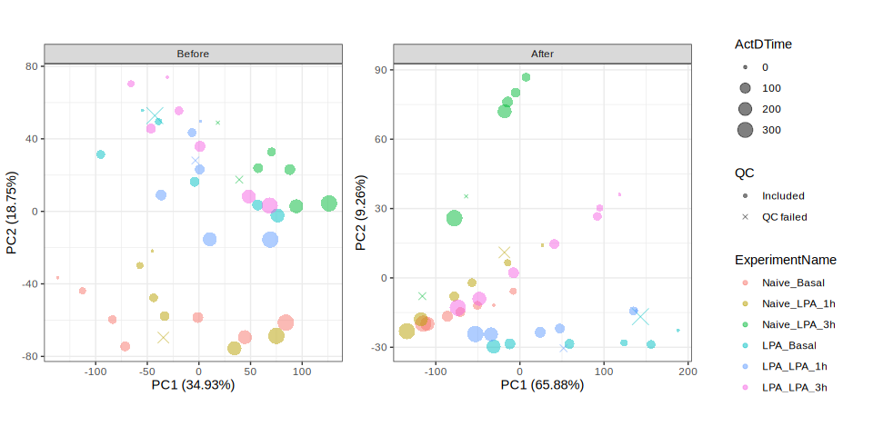
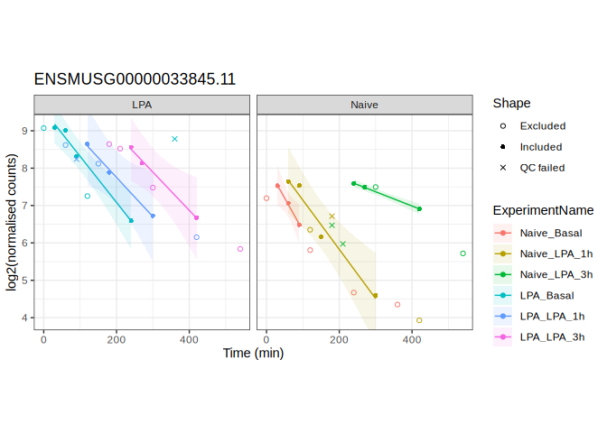
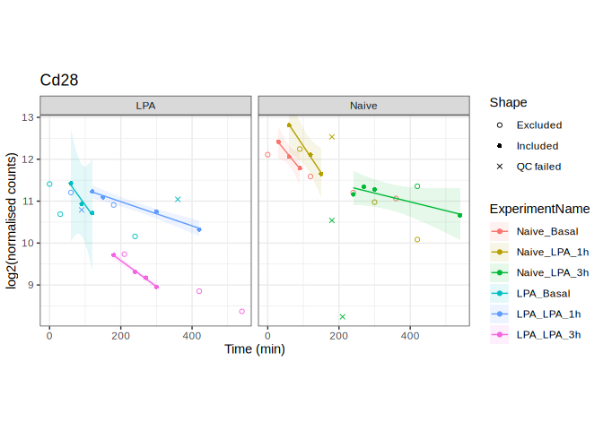
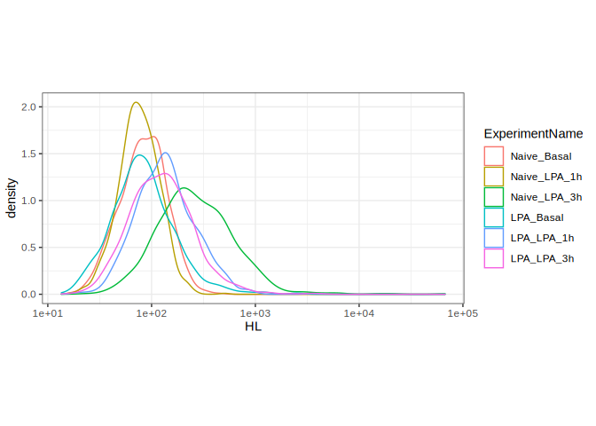
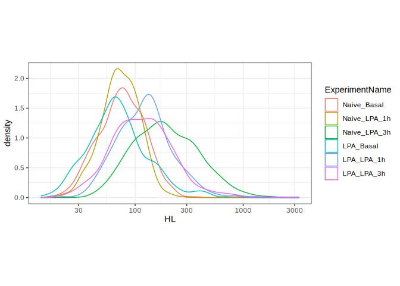

<!-- README.md is generated from README.Rmd. Please edit that file -->

# ActDAnalyser

<!-- badges: start -->

<!-- badges: end -->

## Description

This package provides an easy way to analyse ActinomycinD RNA sequencing
data and to infer RNA half-life from it.

If you only want to access measured half-life you can use the
[ActDBrowser](https://www.signalingsystems.ucla.edu/ActDBrowser), that
will allow to search available datasets for measured half-life for
specific genes or overall distributions.

## Installation

You can install this package by using devtools package:

``` r
devtools::install_github("dlefaudeux-ucla/ActDAnalyser")
```

If you don’t have devtools installed you can install it using:

``` r
install.packages('devtools')
```

Once ActDAnalyser is installed then you can load it:

``` r
library('ActDAnalyser')
```

## Tutorial

### Test Datasets

You can use the demo data BMDM\_dataset or MEF\_dataset. To get a
description of the datatsets run for example:

``` r
?BMDM_dataset
```

Let’s work on the BMDM dataset. Attach the dataset to make all object
available:

``` r
attach(BMDM_dataset)
```

Thefollowing objects corresponds to object you would need to have to be
able to run the pipeline:

  - **full\_count:** corresponds to the count tables, every column
    corresponds to one sample an every row to one gene. Moreover the row
    names must correspond to the gene id.

<!-- end list -->

``` r
full_counts[1:10,1:3]
#>                      ActD_Naive_L0A0_b1 ActD_Naive_L0A30_b1 ActD_Naive_L0A60_b1
#> ENSMUSG00000102693.1                  0                   0                   0
#> ENSMUSG00000064842.1                  0                   0                   0
#> ENSMUSG00000051951.5                  0                   0                   0
#> ENSMUSG00000102851.1                  0                   0                   0
#> ENSMUSG00000103377.1                  0                   0                   0
#> ENSMUSG00000104017.1                  0                   0                   0
#> ENSMUSG00000103025.1                  0                   0                   0
#> ENSMUSG00000089699.1                  0                   0                   0
#> ENSMUSG00000103201.1                  0                   0                   0
#> ENSMUSG00000103147.1                  0                   0                   0
str(full_counts)
#> 'data.frame':    45798 obs. of  42 variables:
#>  $ ActD_Naive_L0A0_b1    : int  0 0 0 0 0 0 0 0 0 0 ...
#>  $ ActD_Naive_L0A30_b1   : int  0 0 0 0 0 0 0 0 0 0 ...
#>  $ ActD_Naive_L0A60_b1   : int  0 0 0 0 0 0 0 0 0 0 ...
#>  $ ActD_Naive_L0A90_b1   : int  0 0 0 0 0 2 0 0 0 0 ...
#>  $ ActD_Naive_L0A120_b1  : int  0 0 0 0 0 0 0 0 0 1 ...
#>  $ ActD_Naive_L0A240_b1  : int  0 0 0 0 0 0 0 0 0 0 ...
#>  $ ActD_Naive_L0A360_b1  : int  0 0 0 0 0 3 0 0 0 0 ...
#>  $ ActD_Naive_L60A0_b1   : int  0 0 0 0 0 1 0 0 0 0 ...
#>  $ ActD_Naive_L60A30_b1  : int  0 0 0 0 0 0 0 0 0 0 ...
#>  $ ActD_Naive_L60A60_b1  : int  0 0 0 0 0 0 0 0 0 0 ...
#>  $ ActD_Naive_L60A90_b1  : int  0 0 0 0 0 0 0 0 0 0 ...
#>  $ ActD_Naive_L60A120_b1 : int  0 0 0 0 0 0 0 0 0 0 ...
#>  $ ActD_Naive_L60A240_b1 : int  0 0 0 0 0 0 0 0 0 0 ...
#>  $ ActD_Naive_L60A360_b1 : int  0 0 0 0 0 0 0 0 0 0 ...
#>  $ ActD_Naive_L180A0_b1  : int  0 0 0 0 0 0 0 0 0 0 ...
#>  $ ActD_Naive_L180A30_b1 : int  0 0 0 0 0 0 0 0 0 0 ...
#>  $ ActD_Naive_L180A60_b1 : int  0 0 0 0 0 0 0 0 0 0 ...
#>  $ ActD_Naive_L180A90_b1 : int  0 0 0 0 0 1 0 0 0 0 ...
#>  $ ActD_Naive_L180A120_b1: int  0 0 0 0 0 0 0 0 0 0 ...
#>  $ ActD_Naive_L180A240_b1: int  0 0 0 0 0 0 0 0 0 0 ...
#>  $ ActD_Naive_L180A360_b1: int  0 0 0 0 0 0 0 0 0 0 ...
#>  $ ActD_LPA_L0A0_b1      : int  0 0 0 0 0 0 0 0 0 0 ...
#>  $ ActD_LPA_L0A30_b1     : int  0 0 0 0 0 0 0 0 0 0 ...
#>  $ ActD_LPA_L0A60_b1     : int  0 0 0 0 0 0 0 0 0 0 ...
#>  $ ActD_LPA_L0A90_b1     : int  0 0 0 0 0 0 0 0 0 0 ...
#>  $ ActD_LPA_L0A120_b1    : int  0 0 0 0 0 0 0 0 0 0 ...
#>  $ ActD_LPA_L0A240_b1    : int  0 0 0 0 0 0 0 0 0 0 ...
#>  $ ActD_LPA_L0A360_b1    : int  0 0 0 0 0 0 0 0 0 0 ...
#>  $ ActD_LPA_L60A0_b1     : int  0 0 0 0 0 0 0 0 0 0 ...
#>  $ ActD_LPA_L60A30_b1    : int  0 0 0 0 0 0 0 0 0 0 ...
#>  $ ActD_LPA_L60A60_b1    : int  0 0 0 0 0 0 0 0 0 0 ...
#>  $ ActD_LPA_L60A90_b1    : int  0 0 0 0 0 0 0 0 0 0 ...
#>  $ ActD_LPA_L60A120_b1   : int  0 0 0 0 0 0 0 0 0 0 ...
#>  $ ActD_LPA_L60A240_b1   : int  0 0 0 0 0 0 0 0 0 0 ...
#>  $ ActD_LPA_L60A360_b1   : int  0 0 0 0 0 0 0 0 0 0 ...
#>  $ ActD_LPA_L180A0_b1    : int  0 0 0 0 0 0 0 0 0 0 ...
#>  $ ActD_LPA_L180A30_b1   : int  0 0 0 0 0 0 0 0 0 0 ...
#>  $ ActD_LPA_L180A60_b1   : int  0 0 0 0 0 0 0 0 0 0 ...
#>  $ ActD_LPA_L180A90_b1   : int  0 0 0 0 0 0 0 0 0 0 ...
#>  $ ActD_LPA_L180A120_b1  : int  0 0 0 0 0 0 0 0 0 0 ...
#>  $ ActD_LPA_L180A240_b1  : int  0 0 0 0 0 0 0 0 0 0 ...
#>  $ ActD_LPA_L180A360_b1  : int  0 0 0 0 0 1 0 0 0 0 ...
```

  - **gene\_infos:** corresponds to additional information on the genes.
    It must contain a column named Geneid that match the row names of
    full\_counts.

<!-- end list -->

``` r
str(gene_infos)
#> 'data.frame':    45798 obs. of  7 variables:
#>  $ Geneid: Factor w/ 45798 levels "ENSMUSG00000000001.4",..: 41219 18296 15210 41370 41865 42473 41536 30800 41700 41648 ...
#>  $ Chr   : Factor w/ 2865 levels "chr1","chr1;chr1",..: 1 1 7 1 1 1 1 2 1 1 ...
#>  $ Start : Factor w/ 45685 levels "1","100006021",..: 20741 20874 21288 21501 22009 22058 22537 22549 22775 22858 ...
#>  $ End   : Factor w/ 45743 levels "100006584","100006647;100010119;100017090;100017090;100020981;100020981;100022108;100022108;100022108;100023945;100023945;1"| __truncated__,..: 20769 20897 21315 21526 22045 22090 22575 22571 22805 22884 ...
#>  $ Strand: Factor w/ 550 levels "-","-;-","-;-;-",..: 276 276 7 276 1 1 1 277 1 276 ...
#>  $ Length: int  1070 110 6094 480 2819 2233 2309 250 2057 926 ...
#>  $ Symbol: chr  "4933401J01Rik" "Gm26206" "Xkr4" "Gm18956" ...
```

  - **metadata:** corresponds to additional data related to the
    full\_counts object. The metadata data.frame must have specific
    format. The column names must match exactly the ones in this
    example.  
    The following columns are absolutely required:
      - *ExperimentNumber:* integer, must be identical for a single
        ActinomycinD timeserie
      - *ExperimentName:* character, names given to single ActinomycinD
        timeserie. It must correspond to a single ExperimentNumber
      - *ExperimentReplicate:* integer, for each experiment a number to
        match specific experiment replicate
      - *ActDTime:* numeric, time between ActinomycinD treatment and
        sample sequencing. Must be in minutes
      - *StimulusTime:* numeric, for timeseries half-life estimation,
        time between stimulus and ActD treatment. Must be in minutes. I
        the experiments corresponds to steady- state half-life then set
        all the values in this column to 0
      - *SampleName:* character, name of each sample. Must match the
        column names of the full\_counts
      - *QC:* character, if for any a specific sample needs to be
        removed from the analysis set its value to ‘QC failed’ (it must
        be exactly written this way). Otherwise set all values to
        ‘Included’

<!-- end list -->

``` r
str(metadata)
#> 'data.frame':    42 obs. of  13 variables:
#>  $ Organism           : chr  "Mouse" "Mouse" "Mouse" "Mouse" ...
#>  $ Genotype           : chr  "WT" "WT" "WT" "WT" ...
#>  $ CellType           : chr  "BMDM" "BMDM" "BMDM" "BMDM" ...
#>  $ Conditioning       : chr  "Naive" "Naive" "Naive" "Naive" ...
#>  $ ExperimentNumber   : int  1 1 1 1 1 1 1 2 2 2 ...
#>  $ ExperimentName     : Factor w/ 6 levels "Naive_Basal",..: 1 1 1 1 1 1 1 2 2 2 ...
#>  $ ExperimentReplicate: num  1 1 1 1 1 1 1 1 1 1 ...
#>  $ ActDTime           : num  0 30 60 90 120 240 360 0 30 60 ...
#>  $ Stimulus           : Factor w/ 2 levels "None","LPA": 1 1 1 1 1 1 1 2 2 2 ...
#>  $ StimulusTime       : num  0 0 0 0 0 0 0 60 60 60 ...
#>  $ SampleName         : chr  "ActD_Naive_L0A0_b1" "ActD_Naive_L0A30_b1" "ActD_Naive_L0A60_b1" "ActD_Naive_L0A90_b1" ...
#>  $ QC                 : chr  "Included" "Included" "Included" "Included" ...
#>  $ GEOid              : chr  "" "" "" "" ...
```

You can check your metadata dat.frame for obvious inconsistency wiyh:

``` r
checkMetadata(metadata, full_counts, type = 'all')
#> The metadata seems suitable.
```

### Prepocessing

First we remove genes that have low counts for all samples:

``` r
filtered <- applyCountThreshold(data = full_counts, metadata = metadata, threshold=32)
```

Then we are going to separate spike-ins from the rest of the genes.

``` r
tmp <- extractSpikeIn(data = filtered, spikein = "ERCC")
spikeins <- tmp[[1]]
counts <- tmp[[2]]
```

Then we can normalise the data based on the spike-in information

``` r
tmp <- SpikeInsNormalisation(spikeins, counts, gene_infos, metadata)
norm_spikeins <- tmp[[1]]
norm_counts <-  tmp[[2]]
```

Now we can compare the raw data and the normalised data.

``` r
# Plot spike-ins counts before and after normalisation
plotSpikeIns(before = spikeins, after = norm_spikeins, metadata = metadata)
```



As we can see after normalisation the spike in counts are brought to
similar levels.

``` r
# Plot library size before and after normalisation
plotLibrarySize(before = counts, after = norm_counts, metadata = metadata)
```



As we can see most experiment show a decreasing library size after
normalising, which is what we would expect because there will be less
and less RNA given that it is continuously degraded and non produced.  
Experiments that don’t follow that pattern might be of lesser quality
(i.e. the spike-ins addition to each library might be to variable to
lead to accurate results) and the results might not be accurate

``` r
# plot pca of counts before/after normalisation
plotPCA(before = counts, after = norm_counts, metadata = metadata)
```



Simirlaly we can see that some sample behave weird and that is why they
have been set as ‘QC failed’

### Infering Half-life

To infer hal-life use this:

``` r
decay <- inferDecay(norm_counts = norm_counts[1:1000,], metadata = metadata, threshold = 32)
halflife <- convertSlopeToHL(decay)
```

The decay object is used to visulaize specific genes.

The half-life object recapitulate the main result. It is a list with one
element per ActinomycinD experiment.

``` r
head(halflife[[1]])
#>                              HL CI_95_LB  CI_95_UB  CI_75_LB  CI_75_UB
#> ENSMUSG00000033845.11  57.59460 32.15595 275.70750  50.06869  67.78320
#> ENSMUSG00000025903.12 115.51255 63.31229 658.14795  99.86776 136.96951
#> ENSMUSG00000033813.13  73.78635 67.00003  82.10236  72.39314  75.23424
#> ENSMUSG00000033793.10 102.00190 96.28469 108.44092 100.86395 103.16582
#> ENSMUSG00000025907.12  35.57492 24.77430  63.07169  32.85354  38.78786
#> ENSMUSG00000090031.2         NA       NA        NA        NA        NA
#>                        CI_50_LB  CI_50_UB Adj Rsquare
#> ENSMUSG00000033845.11  54.21887  61.41859   0.9922770
#> ENSMUSG00000025903.12 108.47383 123.52812   0.9916142
#> ENSMUSG00000033813.13  73.20281  74.37927   0.9998729
#> ENSMUSG00000033793.10 101.52744 102.48081   0.9999563
#> ENSMUSG00000025907.12  34.39481  36.83890   0.9976483
#> ENSMUSG00000090031.2         NA        NA          NA
```

#### Visulasizing result

You can plot fit for specific genes using

``` r
plotGeneFit(gene = "ENSMUSG00000033845.11", norm_counts = norm_counts, metadata = metadata,
            decay_result = decay, gene_infos = gene_infos, gene_type='Geneid', 
            control=list(facet_grid=list(rows = formula('~Conditioning')), theme = list(aspect.ratio=1)))
#> Results for Experiment: Naive_Basal
#>          HL    CI_95_LB    CI_95_UB    CI_75_LB    CI_75_UB    CI_50_LB 
#>   57.594600   32.155948  275.707500   50.068693   67.783204   54.218872 
#>    CI_50_UB Adj Rsquare 
#>   61.418590    0.992277 
#> 
#> Results for Experiment: Naive_LPA_1h
#>          HL    CI_95_LB    CI_95_UB    CI_75_LB    CI_75_UB    CI_50_LB 
#>  75.9187367  49.7306375 160.3687392  63.4634299  94.4567871  69.0213947 
#>    CI_50_UB Adj Rsquare 
#>  84.3476377   0.9563696 
#> 
#> Results for Experiment: Naive_LPA_3h
#>          HL    CI_95_LB    CI_95_UB    CI_75_LB    CI_75_UB    CI_50_LB 
#> 262.5484516 204.1126591 367.8652888 249.0035938 277.6516561 256.7631521 
#>    CI_50_UB Adj Rsquare 
#> 268.6004654   0.9989852 
#> 
#> Results for Experiment: LPA_Basal
#>          HL    CI_95_LB    CI_95_UB    CI_75_LB    CI_75_UB    CI_50_LB 
#>  81.1729366  58.4396527 132.8535601  70.8946867  94.9367896  75.5927016 
#>    CI_50_UB Adj Rsquare 
#>  87.6426995   0.9758723 
#> 
#> Results for Experiment: LPA_LPA_1h
#>           HL     CI_95_LB     CI_95_UB     CI_75_LB     CI_75_UB     CI_50_LB 
#>   95.2662095   49.5614708 1224.2316224   81.0626365  115.5046106   88.8198955 
#>     CI_50_UB  Adj Rsquare 
#>  102.7214625    0.9895203 
#> 
#> Results for Experiment: LPA_LPA_3h
#>          HL    CI_95_LB    CI_95_UB    CI_75_LB    CI_75_UB    CI_50_LB 
#>  97.7222861  54.5726125 466.8641298  84.9587574 114.9987907  91.9974543 
#>    CI_50_UB Adj Rsquare 
#> 104.2068884   0.9922852
```



Given that the gene\_infos data.frame also has Symbol we can also use
the gene name to plot, for that we need to specify to look in the Symbol
column by setting

``` r
plotGeneFit(gene = "Cd28", norm_counts = norm_counts, metadata = metadata,
            decay_result = decay, gene_infos = gene_infos, gene_type='Symbol', 
            control=list(facet_grid=list(rows = formula('~Conditioning')), theme = list(aspect.ratio=1)))
#> Results for Experiment: Naive_Basal
#>           HL     CI_95_LB     CI_95_UB     CI_75_LB     CI_75_UB     CI_50_LB 
#>   95.8503537   49.2155079 1827.9509925   81.2263768  116.8963424   89.1983919 
#>     CI_50_UB  Adj Rsquare 
#>  103.5744055    0.9889387 
#> 
#> Results for Experiment: Naive_LPA_1h
#>          HL    CI_95_LB    CI_95_UB    CI_75_LB    CI_75_UB    CI_50_LB 
#>  78.4957848  42.4353877 522.5104340  67.5837779  93.6099507  73.5751871 
#>    CI_50_UB Adj Rsquare 
#>  84.1217186   0.9910944 
#> 
#> Results for Experiment: Naive_LPA_3h
#>          HL    CI_95_LB    CI_95_UB    CI_75_LB    CI_75_UB    CI_50_LB 
#> 477.0372395 211.2376901         Inf 324.7453658 898.3038323 385.0858209 
#>    CI_50_UB Adj Rsquare 
#> 626.6759394   0.7809018 
#> 
#> Results for Experiment: LPA_Basal
#>          HL    CI_95_LB    CI_95_UB    CI_75_LB    CI_75_UB    CI_50_LB 
#>  84.7846103  21.4802823         Inf  54.3506712 192.6726632  68.8219717 
#>    CI_50_UB Adj Rsquare 
#> 110.3881510   0.8978994 
#> 
#> Results for Experiment: LPA_LPA_1h
#>          HL    CI_95_LB    CI_95_UB    CI_75_LB    CI_75_UB    CI_50_LB 
#> 346.7375176 264.4236228 503.4634423 310.6918035 392.2448155 327.3971018 
#>    CI_50_UB Adj Rsquare 
#> 368.5063934   0.9844593 
#> 
#> Results for Experiment: LPA_LPA_3h
#>          HL    CI_95_LB    CI_95_UB    CI_75_LB    CI_75_UB    CI_50_LB 
#> 161.6659610 135.6271051 200.0788082 150.8707440 174.1250905 155.9830496 
#>    CI_50_UB Adj Rsquare 
#> 167.7786190   0.9940506
```



Additionally you can also plot the distribution of all the genes for a
specific R² threshold.

``` r
plotDistribution(HL = halflife, metadata = metadata ,
            control=list(theme = list(aspect.ratio=0.5)))
#> Warning: Removed 554 rows containing non-finite values (stat_density).
```



You can also only plot the distribution of genes having a adjusted R²
within a specified interval. Here set to show distribution for fits
having and adjusted R² between 0.99 and 1.

``` r
plotDistribution(HL = halflife, metadata = metadata , r2_th = c(0.99,1),
            control=list(theme = list(aspect.ratio=0.5)))
#> Warning: Removed 554 rows containing non-finite values (stat_density).
```


